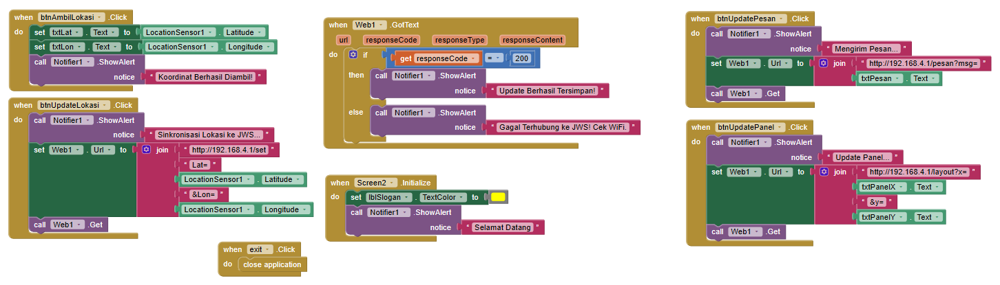

# JWS SYNCHRO CORE - SMK ELECTRONICS ENGINEERING

Repositori ini berisi sistem **Jadwal Waktu Sholat (JWS)** berbasis sinkronisasi Master-Slave menggunakan dua mikrokontroler (ESP8266). Sistem ini menggabungkan tampilan **NeoPixel 7-Segment** (Master) dan **Panel LED Matrix P10** (Slave).

## 🛠️ Arsitektur Sistem

Sistem ini menggunakan komunikasi **Serial UART** satu arah:
1.  **Master (Wemos D1 Mini/NodeMCU):** Bertanggung jawab atas pengolahan waktu (RTC DS3231), kalkulasi jadwal sholat, manajemen WiFi NTP, dan kontrol LED NeoPixel.
2.  **Slave (ESP8266):** Bertanggung jawab khusus untuk rendering visual pada Panel P10 (Running Text, Animasi Typewriter, dan Jadwal Sholat).

---

## 🚀 Fitur Utama

* **Dual Display Sync:** Tampilan Jam Utama di NeoPixel dan informasi detail di P10.
* **Smart Messaging:** Pesan motivasi otomatis (Smart People, dll) setiap 15 menit.
* **Independent Messaging:** Pesan dari aplikasi HP tidak akan tertimpa oleh pesan otomatis sistem.
* **Auto-Salam:** Ucapan salam otomatis setiap memasuki waktu sholat.
* **WiFi Loading UI:** Indikator warna **Cyan Cycling** pada NeoPixel saat mencari koneksi.
* **Offline Mode:** Tetap akurat menggunakan RTC DS3231 jika WiFi tidak tersedia.

---

## 🔌 Skema Pinout (Hardware)

### 1. Master Side (ESP8266)
| Komponen | Pin ESP8266 | Fungsi |
| :--- | :--- | :--- |
| **NeoPixel** | `D6` | Data Out |
| **RTC DS3231** | `D1 (SCL), D2 (SDA)` | I2C Communication |
| **DFPlayer Mini** | `D7 (RX), D5 (TX)` | MP3 Audio Trigger |
| **Serial to Slave** | `TX` | Data Link ke Slave |

### 2. Slave Side (ESP8266)
| Komponen | Pin ESP8266 | Fungsi |
| :--- | :--- | :--- |
| **Panel P10** | `D1, D3, D5, D7, D8` | SPI/DMD Interface |
| **Serial Input** | `RX` | Data Link dari Master |

---

## 📂 Struktur Folder
* `/Master_Code`: Kode utama untuk ESP8266 Master.
* `/Slave_Code`: Kode renderer untuk ESP8266 Slave P10.
* `/Docs`: Skema rangkaian dan panduan penggunaan bagi siswa.

---

## 📝 Instruksi Instalasi untuk Siswa

1.  **Persiapan Library:** Pastikan Arduino IDE sudah terinstall library:
    * `DMDESP`, `Adafruit_NeoPixel`, `RTClib`, `PrayerTimes`, `NTPClient`, `DFRobotDFPlayerMini`.
2.  **Upload Master:** Buka file di folder `/Master_Code`, sesuaikan SSID WiFi jika perlu, lalu upload ke board Master.
3.  **Upload Slave:** Buka file di folder `/Slave_Code`, pastikan konfigurasi jumlah panel (`pnlX`) sudah sesuai, lalu upload.
4.  **Wiring Check:** Pastikan GND antara Master dan Slave terhubung (Common Ground) agar data serial tidak *corrupt*.

---

## 📌 Pesan Motivasi Sistem
> "SMART PEOPLE NEVER FEEL STRONGEST"
> "TEKNIK ELEKTRONIKA SMK - DISIPLIN & KREATIF"

---
**Author:** Bapak Guru - SMK Electronics Engineering  
**Location:** Sleman, Yogyakarta, Indonesia  
**Version:** v1.7 (Stable Release)

## 📂 Dokumen Teknis
Silakan unduh dokumen panduan di bawah ini:

## 🖼️ Preview Project

